# Customer Review Insights & Response Generator

An automated AI-powered workflow that analyzes customer reviews, generates summaries, identifies sentiment and tone, logs results to Google Sheets, and sends email alerts for negative reviews.

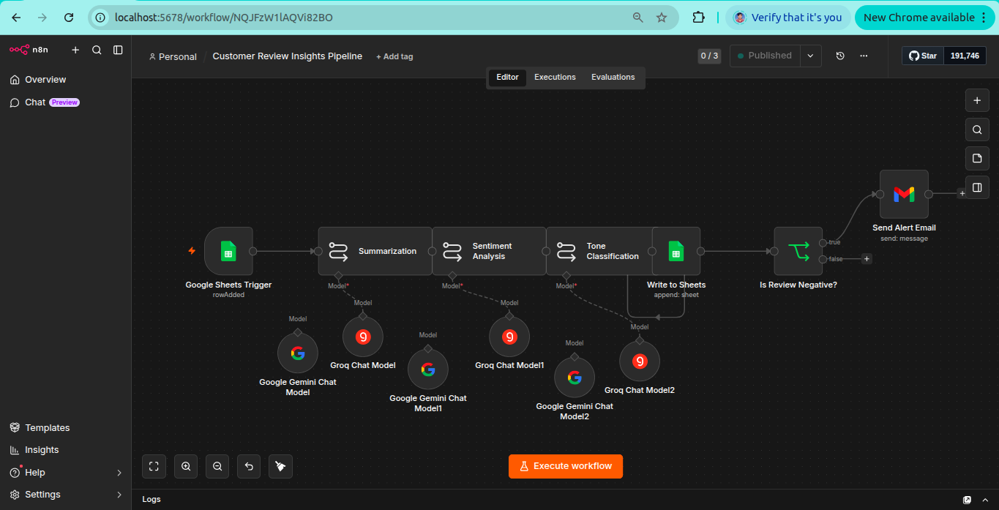
*n8n workflow canvas showing the complete pipeline*

---

## What It Does

- Collects reviews via Google Form → Google Sheets
- Summarizes each review using an LLM
- Detects sentiment (Positive / Neutral / Negative) with a score
- Classifies tone (Informative / Persuasive / Friendly) with a score
- Logs all insights into a separate Google Sheet
- Automatically emails the team when a negative review is detected

---

## Tech Stack

| Tool | Purpose |
|---|---|
| n8n (self-hosted) | Workflow automation & orchestration |
| Groq API (llama-3.1-8b-instant) | LLM for summarization, sentiment, tone |
| Google Sheets | Review input & insights logging |
| Google Form | Review collection interface |
| Gmail | Automated negative review alerts |
| Docker | Running n8n locally |

---

## Prerequisites

- Docker installed on your machine
- A Google account (for Sheets, Forms, Gmail)
- A Google Cloud project with OAuth credentials
- A Groq API key (free at [console.groq.com](https://console.groq.com))

---

## Setup Guide

### Step 1: Run n8n with Docker

```bash
mkdir -p ~/.n8n && sudo chown -R 1000:1000 ~/.n8n

docker run -it --rm --name n8n -p 5678:5678 \
  -v ~/.n8n:/home/node/.n8n \
  docker.n8n.io/n8nio/n8n
```

Open [http://localhost:5678](http://localhost:5678) in your browser and create an account.

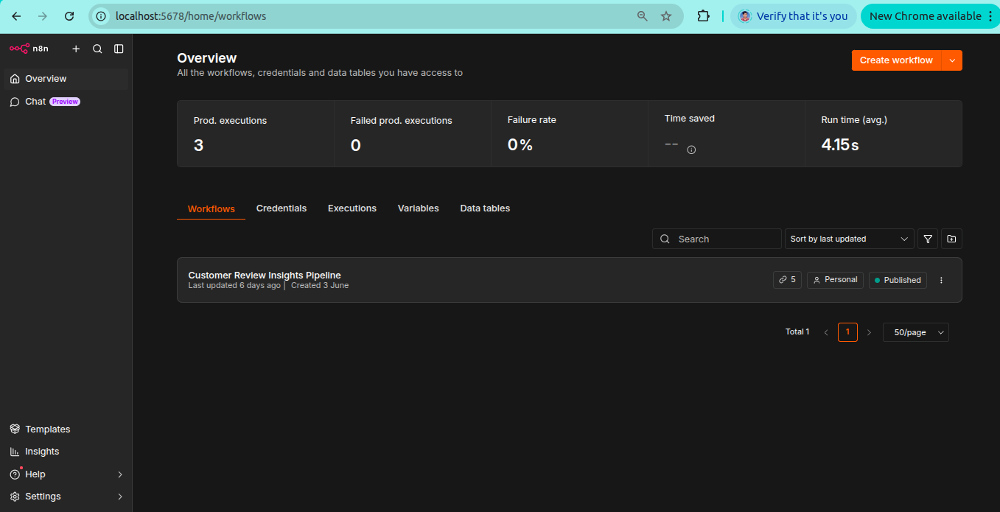

---

### Step 2: Create Google Form

1. Go to [forms.google.com](https://forms.google.com) → click **Blank form**
2. Name it `Customer Review Form`
3. Add these fields:

| Field | Type |
|---|---|
| Product Name | Short answer |
| Email Address | Short answer |
| Rating | Short answer or Linear scale (1–5) |
| Feedback | Paragraph |

4. Click the **Responses** tab → click the green **Sheets icon**
5. Select **Create a new spreadsheet** → name it `Customer Reviews` → click Create

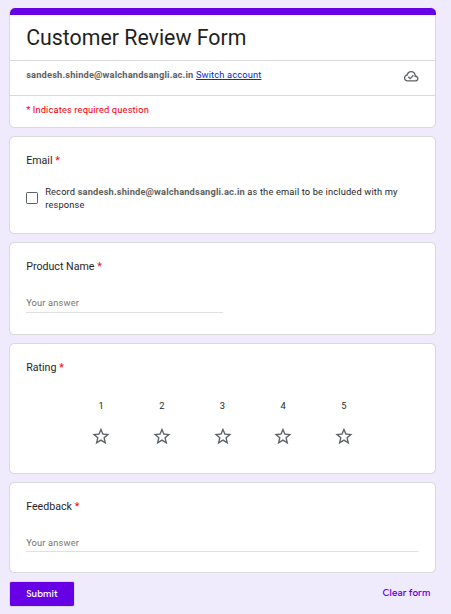

---

### Step 3: Set Up the Insights Sheet

In the `Customer Reviews` Google Sheet:

1. Click the **+** at the bottom to add a new sheet tab
2. Rename it `Results`
3. Add these headers in Row 1:

| A | B | C | D | E |
|---|---|---|---|---|
| Product Name | Product Review | Summary | Sentiment & Score | Tone & Score |

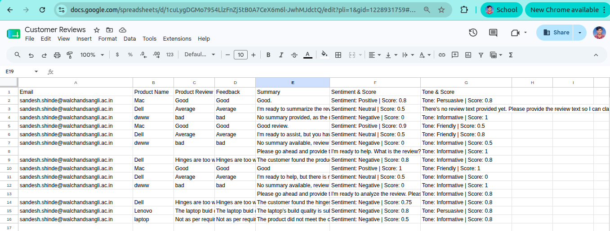

---

### Step 4: Create Google Cloud OAuth Credentials

1. Go to [console.cloud.google.com](https://console.cloud.google.com)
2. Create a new project
3. Go to **APIs & Services → Library** and enable:
   - `Google Sheets API`
   - `Gmail API`
4. Go to **APIs & Services → Credentials → + Create Credentials → OAuth 2.0 Client ID**
5. Configure OAuth consent screen first (External, fill in app name and email)
6. Application type: **Web application**
7. Add these URIs:
   - Authorized JavaScript origins: `http://localhost:5678`
   - Authorized redirect URIs: `http://localhost:5678/rest/oauth2-credential/callback`
8. Copy the **Client ID** and **Client Secret**

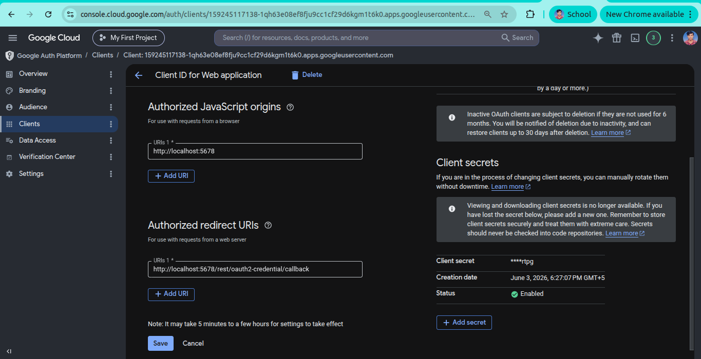

---

### Step 5: Get Groq API Key

1. Go to [console.groq.com](https://console.groq.com)
2. Sign up → **API Keys → Create API Key**
3. Copy the key

---

### Step 6: Import the Workflow into n8n

1. In n8n, click **Build a workflow**
2. Click the **⋯ menu** (top right) → **Import from JSON**
3. Paste the contents of `n8n_project5_workflow.json`
4. Click **Save**

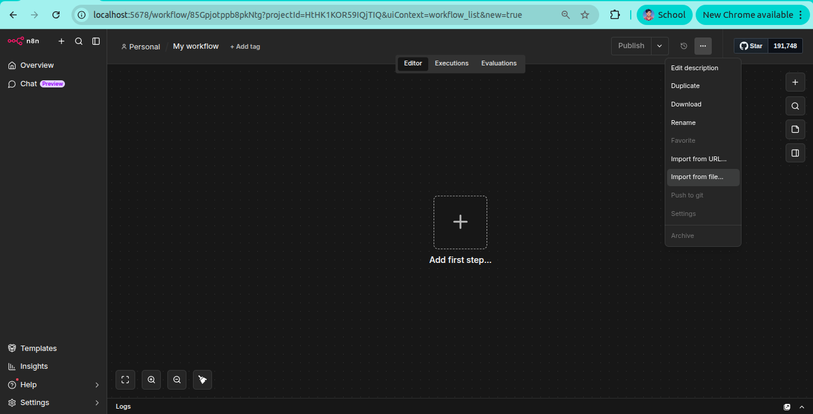

---

### Step 7: Configure Google Sheets Trigger Node

1. Click the **Google Sheets Trigger** node
2. Click **Set up credential → Google Sheets OAuth2**
3. Enter Client ID and Client Secret → click **Sign in with Google**
4. Set:
   - Mode: `Every Minute`
   - Document: your `Customer Reviews` sheet
   - Sheet: `Form Responses 1`
   - Trigger On: `Row Added`
5. Click **Test this trigger** → submit a test form response to verify

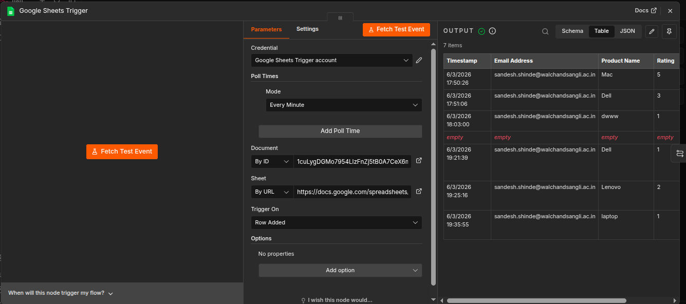

---

### Step 8: Configure LLM Nodes (Summarization, Sentiment, Tone)

For each of the 3 LLM nodes:

1. Click the node → click **+** under `Model*`
2. Select **Groq Chat Model**
3. Create new credential → paste your Groq API key
4. Model: `llama-3.1-8b-instant`
5. Reuse the same credential for all 3 nodes

Prompts are pre-configured in the imported workflow:

- **Summarization**: summarizes review in 1–2 sentences
- **Sentiment Analysis**: returns `Sentiment: <value> | Score: <0-1>`
- **Tone Classification**: returns `Tone: <value> | Score: <0-1>`

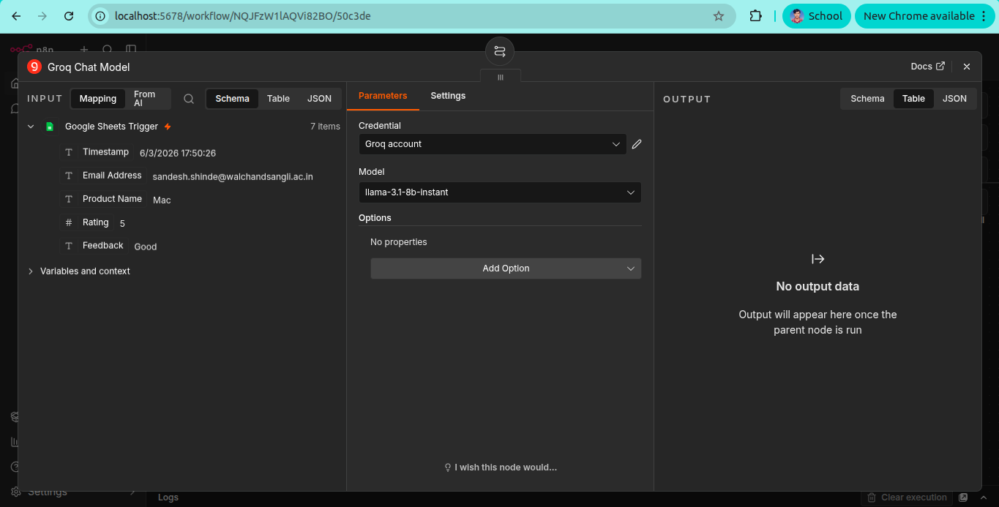

---

### Step 9: Configure Write to Sheets Node

1. Click the **Write to Sheets** node
2. Credential → select your Google Sheets OAuth credential
3. Set:
   - Resource: `Sheet Within Document`
   - Operation: `Append Row`
   - Document: your `Customer Reviews` sheet
   - Sheet: `Results`
   - Mapping Column Mode: `Map Each Column Manually`
4. Add 5 fields:

| Column Name | Expression |
|---|---|
| Product Name | `{{ $('Google Sheets Trigger').item.json['Product Name'] }}` |
| Product Review | `{{ $('Google Sheets Trigger').item.json['Feedback'] }}` |
| Summary | `{{ $('Summarization').item.json.text }}` |
| Sentiment & Score | `{{ $('Sentiment Analysis').item.json.text }}` |
| Tone & Score | `{{ $('Tone Classification').item.json.text }}` |

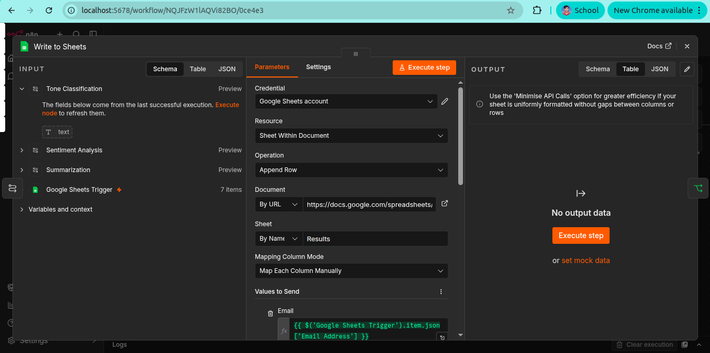 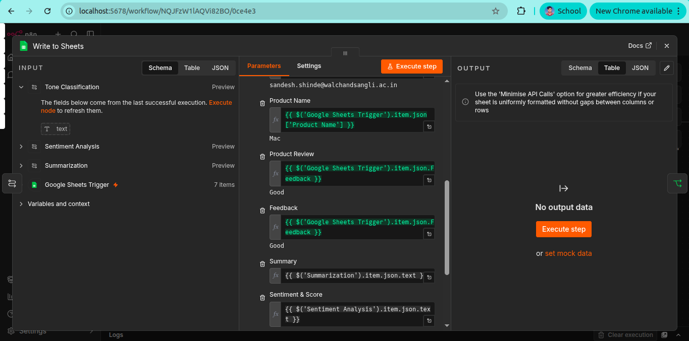

---

### Step 10: Configure Is Review Negative? Node

This node is pre-configured. Verify it has:

- Value 1: `{{ $('Sentiment Analysis').item.json.text }}`
- Operation: `Contains`
- Value 2: `Negative`

True branch → sends email. False branch → workflow ends.

---

### Step 11: Configure Gmail Node

1. Click **Send Alert Email** node
2. Credential → Create new → **Gmail OAuth2**
3. Use the same Google Cloud project (Gmail API already enabled)
4. Click **Sign in with Google**
5. Set **To** field to your team lead's email
6. Message body (HTML):

```html
Dear Team Lead,<br><br>
We have received a <b>negative customer review</b>. Details below:<br><br>

<table border="1" cellpadding="8" cellspacing="0" style="border-collapse:collapse; font-family:Arial, sans-serif;">
  <tr style="background-color:#6a0dad; color:white;">
    <th>Field</th><th>Details</th>
  </tr>
  <tr>
    <td><b>Product Name</b></td>
    <td>{{ $('Google Sheets Trigger').item.json['Product Name'] }}</td>
  </tr>
  <tr style="background-color:#f2f2f2;">
    <td><b>Customer Email</b></td>
    <td>{{ $('Google Sheets Trigger').item.json['Email Address'] }}</td>
  </tr>
  <tr>
    <td><b>Rating</b></td>
    <td>{{ $('Google Sheets Trigger').item.json['Rating'] }}</td>
  </tr>
  <tr style="background-color:#f2f2f2;">
    <td><b>Feedback</b></td>
    <td>{{ $('Google Sheets Trigger').item.json['Feedback'] }}</td>
  </tr>
  <tr>
    <td><b>Summary</b></td>
    <td>{{ $('Summarization').item.json.text }}</td>
  </tr>
  <tr style="background-color:#f2f2f2;">
    <td><b>Sentiment & Score</b></td>
    <td>{{ $('Sentiment Analysis').item.json.text }}</td>
  </tr>
  <tr>
    <td><b>Tone & Score</b></td>
    <td>{{ $('Tone Classification').item.json.text }}</td>
  </tr>
</table>

<br>Please review and take necessary action.<br><br>
Best Regards,<br>
Workflow Automation Team
```

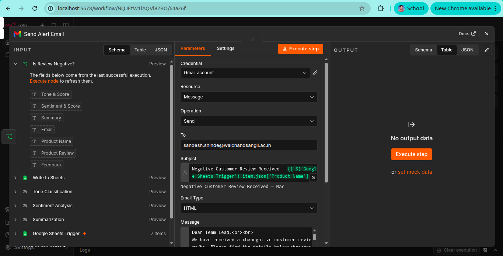

---

### Step 12: Activate the Workflow

Click **Publish** (top right of the canvas) to activate the workflow.

Once active, n8n polls the Google Sheet every minute. Any new form submission automatically triggers the full pipeline.

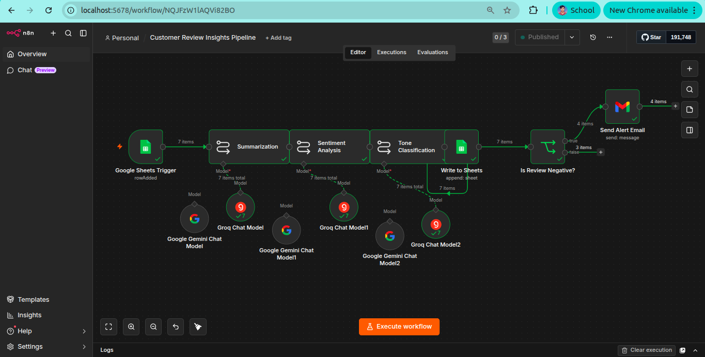

---

## How to Test

1. Open your Google Form
2. Submit a review with negative feedback (e.g., Rating: 1, Feedback: "Terrible product, completely broken")
3. Wait up to 1 minute
4. Check:
   - `Results` sheet → new row with summary, sentiment, tone
   - Your inbox → alert email with the review table

---

## Workflow Schematic

```
Google Form Submission
        ↓
Google Sheets (trigger on row added)
        ↓
Summarization (Groq LLM)
        ↓
Sentiment Analysis (Groq LLM)
        ↓
Tone Classification (Groq LLM)
        ↓
Write to Google Sheets (Results tab)
        ↓
Is Sentiment Negative?
   ↓ Yes                ↓ No
Send Gmail Alert     End Workflow
```


## Deliverables

- `n8n_project5_workflow.json` — importable n8n workflow
- `Customer Reviews` Google Sheet — form responses + insights log
- This README with setup instructions
- Alert email screenshots for negative reviews
# Customer-Review-Insights-and-Response-Generator
